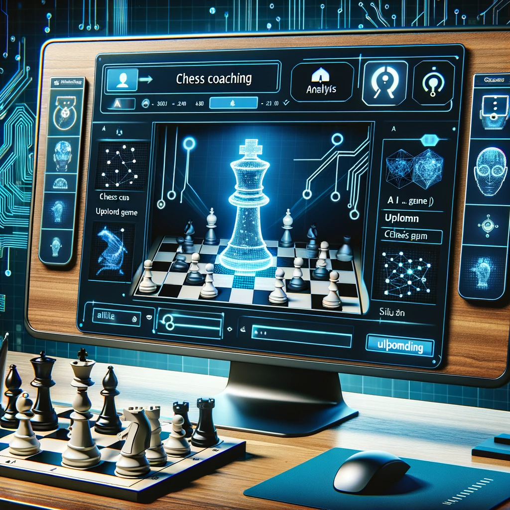
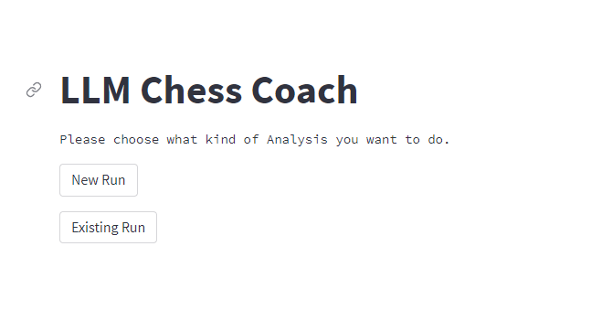
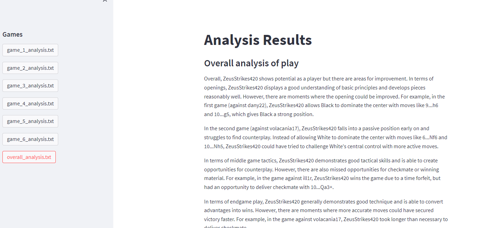

# LLM-ChessCoach

## Introduction
LLM-ChessCoach is an innovative tool that leverages Large Language Models (LLM), specifically GPT-3, along with the Stockfish engine to analyze chess games. It fetches games from online chess platforms, analyzes them, and provides insightful feedback to help players improve their strategies. A lightweight React front end allows scheduling new analyses and reviewing results from any device.

## Features
- **Game Import**: Downloads games from online chess platforms.
- **Advanced Analysis**: Uses GPT-3 and Stockfish to provide detailed game analyses.
- **Batch Processing**: Analyzes multiple games concurrently for efficiency.
- **Scheduling**: Background jobs can be scheduled to fetch and analyze new games automatically.
- **Player Dashboard**: Track analysis history and scheduled runs via a React interface.
- **Social Sharing**: Share analysis links generated by the API.
- **User-Friendly Interface**: React-based front end for all interactions.

## Components
1. `export_lichess_games.py`: Downloads games from a chess website.
2. `chess_coach_app.py`: Old Streamlit interface (still available).
3. `analyze_games.py`: Analyzes games using GPT-3 and Stockfish.
4. `api_server.py`: FastAPI server providing REST endpoints.
5. `react-ui/`: React front end served as static files.
6. `.gitignore`: Specifies untracked files to ignore.
7. `requirements.txt`: Lists all Python libraries required for the project.

## Installation
1. Clone the repository.
2. Install dependencies: `pip install -r requirements.txt`.
3. Install the Stockfish engine (`apt install stockfish` on Ubuntu).
4. Set up your Lichess API token in `config.json`.

## Usage
### API and React UI
1. Start the API server: `uvicorn api_server:app --reload`.
2. Serve the React interface (e.g. `cd react-ui && python -m http.server 8000`).
3. Open `http://localhost:8000` in your browser to schedule or view analyses.

### Legacy Streamlit App
If you prefer the original interface run:
`streamlit run chess_coach_app.py`

## Deployment
1. Build any static assets for the React UI if needed and place them in `react-ui`.
2. Deploy the FastAPI server using a production server such as `uvicorn` or `gunicorn`.
3. Configure a reverse proxy (NGINX or similar) to serve the API and static React files.
4. Ensure the `games/` directory is writable for storing downloaded games and analyses.

## Contributing
Contributions are welcome. Please read the contributing guidelines first.

## License
This project is licensed under the MIT License - see [LICENSE](LICENSE) for details.

## Acknowledgements
- Chess websites for game data.
- OpenAI's GPT-3 for game analysis.

## UI Screenshots

